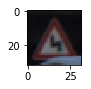

# **Traffic Sign Recognition** 

## Writeup
---

**Build a Traffic Sign Recognition Project**
### Related Files
Python Notebook: [https://github.com/kyesh/CarND-Traffic-Sign-Classifier-Project/blob/master/Traffic_Sign_Classifier.ipynb](https://github.com/kyesh/CarND-Traffic-Sign-Classifier-Project/blob/master/Traffic_Sign_Classifier.ipynb)

Model Parameter: [https://github.com/kyesh/CarND-Traffic-Sign-Classifier-Project/blob/master/lenet0.932.index](https://github.com/kyesh/CarND-Traffic-Sign-Classifier-Project/blob/master/lenet0.932.index)

HTML Notebook: [https://github.com/kyesh/CarND-Traffic-Sign-Classifier-Project/blob/master/Traffic_Sign_Classifier_Sub2.html](https://github.com/kyesh/CarND-Traffic-Sign-Classifier-Project/blob/master/Traffic_Sign_Classifier_Sub2.html)

## Rubric Points
### Here I will consider the [rubric points](https://review.udacity.com/#!/rubrics/481/view) individually and describe how I addressed each point in my implementation.  

---
### Writeup / README

You're reading it! and here is a link to my [project code](https://github.com/kyesh/CarND-Traffic-Sign-Classifier-Project/blob/master/Traffic_Sign_Classifier.ipynb)

### Data Set Summary & Exploration

I used the pandas library to calculate summary statistics of the traffic
signs data set:

* Number of training examples = 34799
* Number of testing examples = 12630
* Image data shape = (32, 32, 3)
* Number of classes = 43

#### 2. Include an exploratory visualization of the dataset.

Here is an example image with classification 

Double Curve

### Design and Test a Model Architecture

#### 1. First I decided to start with the Lenet [project](https://github.com/udacity/CarND-LeNet-Lab)

I copied over the core functionality and transformed it to work with a 3 channel input instead of just 1. I also needed to cast the input images to floats. 

#### 2. Pre-Processing
I ultimately decided to mean normalize them at the same time. My attempts to pickle the preprocessed data did not seem to work so I ended up having to reprocess the data everytime I started again.

#### 3. Final model architecture

My final model consisted of the following layers:

| Layer         		|     Description	        					| 
|:---------------------:|:---------------------------------------------:| 
| Input         		| 32x32x3 RGB image   							| 
| Convolution 5x5     	| 1x1 stride, Valid padding, outputs 28x28x8 	|
| RELU					|												|
| Max pooling	      	| 2x2 stride,  outputs 14x14x8 				|
| Convolution 5x5	    | 1x1 stride, Valid padding, outputs 10x10x16			|
| RELU					|												|
| Max pooling	      	| 2x2 stride,  outputs 5x5x16 				|
| Fully connected		| Input = 400. Output = 120									|
| RELU					|												|
| Fully connected  | Input = 120. Output = 84         |
| RELU					|												|
| Fully connected  | Input = 84. Output = 43         |
| Softmax				|  Softmax All Possible Outputs       									|

The main changes I made from the LeNet Project were changing the number of input channels to 3, the number of output channels to 43 and adding two more depth to the output of the first layer.

#### 4. Model Training/Solution Approach

I noticed that ocasionally the model accuracy to would decrease after a step which is supposed to be a sign of a learning rate that is too high. So I came up with the stratagey of saving the parameters with the heighest accuracy seen so far. Then after running that set of epochs I could start from the highest accuracy achived with a smaller learning rate to close in on the target.

I used a batch size of 128 and AdamOptimizer which was used in the LeNet Demo. After trying a few values I found after 50 epochs not much was gained on accuracy. Learning rate started at 0.001 but would be set lowere on a second run if a net look promising.

 
### Test a Model on New Images

#### 1. Choose five German traffic signs found on the web and provide them in the report. For each image, discuss what quality or qualities might be difficult to classify.

I found this part kind of ambigous and it was unclear where I should find these images from, how I would get them to work in the 32x32x3 input of my neural net and how I would convert them into the python data structrue needed to run it in TensorFlow. I figured picking 5 random images from the test set would server the same purpose. If not please provide more clarity on this step.

#### 2. Model's predictions on these new traffic signs

After applying the soft max function typically the closest matching pediction would round to a probablity of 1 as the values for the other options were extremely small.

Here are the results of the prediction:

| Image			        |     Prediction	        					| 
|:---------------------:|:---------------------------------------------:| 
| Train Crossing     		| Speed limit (80km/h)   									| 
| Wild Animal Crossing     			| Speed limit (100km/h)										|
| Pedestrain Crossing					| General caution											|
| Steep Grade    		|Speed limit (60km/h)					 				|
| Speed limit (60km/h)		|Speed limit (60km/h)  							|

The model was able to correctly guess 1 of the 5 traffic signs, which gives an accuracy of 20%. This compares poorly to the accuracy on the validation set of 93.2%

#### 3. Softmax Output

##### 3-1

| Probability         	|     Prediction	        					| 
|:---------------------:|:---------------------------------------------:| 
|Speed limit (80km/h)| 0.139 certainty|
|Speed limit (60km/h)| 0.086 certainty|
|Speed limit (120km/h)| 0.064 certainty|
|Speed limit (100km/h)| 0.054 certainty|
|No passing for vehicles over 3.5 metric tons| 0.050 certainty|

##### 3-2

| Probability         	|     Prediction	        					| 
|:---------------------:|:---------------------------------------------:| 
|Speed limit (100km/h)| 0.154 certainty|
|No passing for vehicles over 3.5 metric tons| 0.104 certainty|
|Speed limit (120km/h)| 0.097 certainty|
|Speed limit (80km/h)| 0.092 certainty|
|Wild animals crossing| 0.054 certainty|

##### 3-3

| Probability         	|     Prediction	        					| 
|:---------------------:|:---------------------------------------------:| 
|General caution| 0.112 certainty|
|Right-of-way at the next intersection| 0.091 certainty|
|Speed limit (80km/h)| 0.073 certainty|
|Speed limit (120km/h)| 0.071 certainty|
|Speed limit (100km/h)| 0.064 certainty|

##### 3-4

| Probability         	|     Prediction	        					| 
|:---------------------:|:---------------------------------------------:| 
|Speed limit (60km/h)| 0.161 certainty|
|Speed limit (80km/h)| 0.116 certainty|
|Speed limit (120km/h)| 0.068 certainty|
|No passing for vehicles over 3.5 metric tons| 0.067 certainty|
|Speed limit (100km/h)| 0.060 certainty|

##### 3-5

| Probability         	|     Prediction	        					| 
|:---------------------:|:---------------------------------------------:| 
|Speed limit (60km/h)| 0.137 certainty|
|Speed limit (80km/h)| 0.087 certainty|
|Speed limit (100km/h)| 0.071 certainty|
|End of all speed and passing limits| 0.052 certainty|
|End of speed limit (80km/h)| 0.052 certainty|

### (Optional) Visualizing the Neural Network (See Step 4 of the Ipython notebook for more details)
#### 1. Discuss the visual output of your trained network's feature maps. What characteristics did the neural network use to make classifications?

If your could provide some help with this. That would be apprecaited! I keep getting this error "NameError: name 'conv1_W' is not defined"

